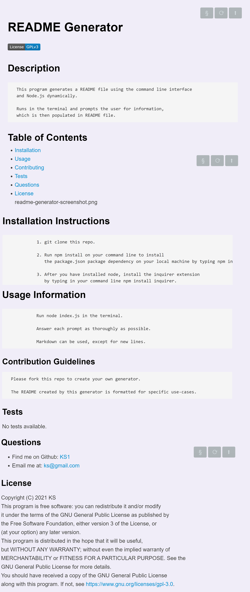

# README Generator

## Description

      This program generates a README file using the command line interface 
      and Node.js dynamically. 

      Runs in the terminal and prompts the user for information, 
      which is then populated in README file.
## Table of Contents
* [Installation](#Installation)
* [Usage](#Usage)
* [Contributing](#Contribution)
* [Tests](#Tests)
* [Questions](#Questions)
* [License](#License)
## Screenshot

readme-generator-screenshot.png
## Video
[Readme Generator video link](https://www.youtube.com/watch?v=d5q8xg6bJn4)

## Installation

 
                1. git clone this repo. 

                2. Run npm install on your command line to install 
                   the package.json package dependency on your local machine by typing npm init. 

                3. After you have installed node, install the inquirer extension 
                   by typing in your command line npm install inquirer.
## Usage

 
                Run node index.js in the terminal. 

                Answer each prompt as thoroughly as possible. 

                Markdown can be used, except for new lines.
### Contribution

      Please fork this repo to create your own generator. 

      The README created by this generator is formatted for specific use-cases.
### Tests
No tests available.
### Questions
- Find me on Github: [KS1](https://github.com/KS1)
- Email me at: ks@gmail.com
### License
Copyright (C) 2021 KS
This program is free software: you can redistribute it and/or modify
it under the terms of the GNU General Public License as published by
the Free Software Foundation, either version 3 of the License, or
(at your option) any later version.
This program is distributed in the hope that it will be useful,
but WITHOUT ANY WARRANTY; without even the implied warranty of
MERCHANTABILITY or FITNESS FOR A PARTICULAR PURPOSE.  See the
GNU General Public License for more details.
You should have received a copy of the GNU General Public License
along with this program.  If not, see https://www.gnu.org/licenses/gpl-3.0.